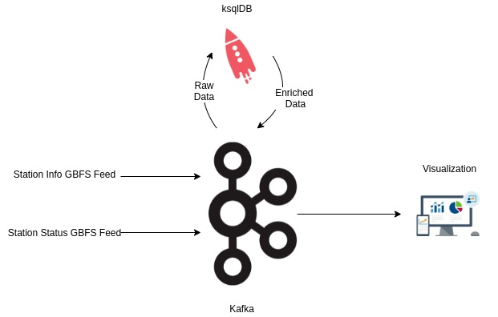

# Streaming Data Pipeline for visualizing availability in Bike Sharing System (BSS)

## Overview

Bike Sharing Systems (BSS) used in major cities today face a common challenge in Repositioning Bikes where needed.
To explain BSS briefly – Docking stations are spread across a city. Each docking station has a bunch of docking slots. Bikes can be hired at docking stations and the users are charged until it’s docked back at a station slot. 

Understanding mobility patterns helps BSS operators to device an optimal strategy to make the bikes available during a time of the day at a particular station. And for sudden spikes, BSS operators usually solve the asymmetric demand by repositioning bikes from top destination stations to top origin stations.

In this demo, real time data from one of France's BSS systems' - Toulouse city GBFS<sup>4</sup> feeds is used. Data feeds from the BSS are joined in realtime to form an enriched stream for downstream consumers.

## Solution Diagram



## Pre-requisite
* curl
* docker and docker-compose


## Steps

1. Run Docker-compose file. Wait for all containers to start

    ` docker-compose up `

2. Building KTable for station-info GBFS feed

    - Stream station-info every minute via HTTP Source Connector
        ``` 
        curl --silent --show-error -XPUT -H 'Content-Type: application/json' \
        http://localhost:8083/connectors/fr-toulouse-station-info-http-source/config \
        -d '{
            "name": "fr-toulouse-station-info-http-source",
            "http.response.list.pointer": "/data/stations",
            "kafka.topic": "bss.fr.toulouse.station_info",
            "http.timer.interval.millis": "60000",
            "http.request.url": "https://transport.data.gouv.fr/gbfs/toulouse/station_information.json",
            "connector.class": "com.github.castorm.kafka.connect.http.HttpSourceConnector",
            "tasks.max": "1",
            "value.converter": "org.apache.kafka.connect.json.JsonConverter",
            "transforms": "ExtractField",
            "transforms.ExtractField.type": "org.apache.kafka.connect.transforms.ExtractField$Value",
            "transforms.ExtractField.field": "value"
        }' 
        ```

    - You should see data streaming in a topic named `bss.fr.toulouse.station_info` in Control Center(http://localhost:9021)

    - Create a raw stream out of the topic data using ksqlDB editor in Control Center
        ```
        CREATE STREAM fr_toulouse_station_info_raw(payload VARCHAR) WITH (KAFKA_TOPIC='bss.fr.toulouse.station_info',VALUE_FORMAT='json');
        ```

    - Create a Stream by parsing string payload into data columns with station_id as partition key.
        ```
        CREATE STREAM FR_TOULOUSE_STATION_INFO_STREAM AS
        SELECT EXTRACTJSONFIELD(payload, '$.station_id') as station_id,
            EXTRACTJSONFIELD(payload, '$.name') as station_name,
            EXTRACTJSONFIELD(payload, '$.address') as address,
            CAST(EXTRACTJSONFIELD(payload, '$.capacity') AS INT) as capacity,
            CAST(EXTRACTJSONFIELD(payload, '$.lat') AS DOUBLE) as latitude,
            CAST(EXTRACTJSONFIELD(payload, '$.lon') AS DOUBLE) as longitude
        FROM fr_toulouse_station_info_raw 
        PARTITION BY EXTRACTJSONFIELD(fr_toulouse_station_info_raw.PAYLOAD, '$.station_id')
        emit changes;
        ```

    - Create KTable from the above stream 
        ```
        CREATE TABLE FR_TOULOUSE_STATION_INFO_TABLE(STATION_ID VARCHAR PRIMARY KEY,
                                STATION_NAME VARCHAR,
								ADDRESS VARCHAR,
								CAPACITY INT,
				                LATITUDE DOUBLE,
				                LONGITUDE DOUBLE) 
         WITH (KAFKA_TOPIC='FR_TOULOUSE_STATION_INFO_STREAM', KEY_FORMAT='KAFKA',VALUE_FORMAT='JSON');
        ```

    - Query KTable topic to see the table data
        ```
        select * from FR_TOULOUSE_STATION_INFO_TABLE EMIT CHANGES;
        ```

3. Building KStream for station-status GBFS feed

    - Create a HTTP Source Connector to fetch feed from station-status GBFS feed. Tune the `timer.interval.millis` parameter based on the source udpate frequency 
        ```
        curl --silent --show-error -XPUT -H 'Content-Type: application/json' \
            http://localhost:8083/connectors/fr-toulouse-station-status-http-source/config \
            -d '{
                "name": "fr-toulouse-station-status-http-source",
                "http.response.list.pointer": "/data/stations",
                "kafka.topic": "bss.fr.toulouse.station_status",
                "http.timer.interval.millis": "35000",
                "http.request.url": "https://transport.data.gouv.fr/gbfs/toulouse/station_status.json",
                "connector.class": "com.github.castorm.kafka.connect.http.HttpSourceConnector",
                "tasks.max": "1",
                "value.converter": "org.apache.kafka.connect.json.JsonConverter",
                "transforms": "ExtractField",
                "transforms.ExtractField.type": "org.apache.kafka.connect.transforms.ExtractField$Value",
                "transforms.ExtractField.field": "value"
            }'
        ```

    - In ksqlDB editor, create a raw stream for the above data
        ```
        CREATE STREAM FR_TOULOUSE_station_status_raw(payload VARCHAR) WITH (KAFKA_TOPIC='bss.fr.toulouse.station_status',VALUE_FORMAT='json');
        ```

    - Create a Stream by parsing string payload into data columns with station_id as partition key and filter the stream for stations with is_renting set to 1
        ```
        CREATE STREAM FR_TOULOUSE_STATION_STATUS_STREAM AS SELECT EXTRACTJSONFIELD(payload, '$.station_id') as station_id,
            CAST(EXTRACTJSONFIELD(payload, '$.num_docks_available') AS INT) as num_docks_available,
            CAST(EXTRACTJSONFIELD(payload, '$.num_bikes_available') AS INT) as num_bikes_available,
            CAST(EXTRACTJSONFIELD(payload, '$.last_reported') AS INT) as last_reported
        FROM FR_TOULOUSE_station_status_raw
        WHERE CAST(EXTRACTJSONFIELD(payload, '$.is_renting') AS INT) = 1
        PARTITION BY EXTRACTJSONFIELD(payload, '$.station_id')
        EMIT CHANGES;
        ```
    
    - Query the stream for changes
        ```
        PRINT FR_TOULOUSE_STATION_STATUS_STREAM;
        ```

4. Join station-status KStream with station-info KTable to enrich the status data for visualization. Note that a new column for location is created as a struct - this is because Kibana expects geopoint data in a certain format.

    ```
    CREATE STREAM ELASTIC_FR_TOULOUSE_STATION_STATUS AS
    SELECT SS.STATION_ID AS STATION_ID, SI.STATION_NAME AS STATION_NAME, SI.ADDRESS AS ADDRESS, SI.CAPACITY AS CAPACITY,
            SI.LATITUDE AS LATITUDE, SI.LONGITUDE AS LONGITUDE, STRUCT("lat" := SI.LATITUDE, "lon" := SI.LONGITUDE) AS LOCATION,
        SS.num_bikes_available AS NUM_BIKES_AVAILABLE, SS.num_docks_available AS NUM_DOCKS_AVAILABLE,
        SS.last_reported AS LAST_REPORTED
    FROM FR_TOULOUSE_STATION_STATUS_STREAM SS
    JOIN FR_TOULOUSE_STATION_INFO_TABLE SI
    ON SS.STATION_ID=SI.STATION_ID
    EMIT CHANGES;
    ```

    Query the stream to see merged data
    ```
    PRINT ELASTIC_FR_TOULOUSE_STATION_STATUS;
    ```

5. Stream the merged events to Elasticsearch
    
    - Create a template mapping for geopoint data. This is to index location column as a geopoint data
        ```
            curl --silent --show-error -XPUT -H 'Content-Type: application/json' \
            http://localhost:9200/_index_template/geo_point_template/ \
            -d'{
                "index_patterns": [ "elastic_fr_toulouse_station_status*" ],
                "template": {
                    "mappings": {
                        "properties": {
                            "LOCATION": {
                                "type": "geo_point"
                            }
                        }
                    }
                } }'
        ```

    - Create Elastic Sink Connector. After a minute, data should stream into elastic search and can be seen in indexes here - http://localhost:5601/app/management/data/index_management/indices 
        ```
        curl --silent --show-error -XPUT -H 'Content-Type: application/json' \
        http://localhost:8083/connectors/sink_elastic_fr_toulouse_station_status/config \
        -d '{
            "name": "sink_elastic_fr_toulouse_station_status",
            "value.converter.schemas.enable": "false",
            "connector.class": "io.confluent.connect.elasticsearch.ElasticsearchSinkConnector",
            "key.converter": "org.apache.kafka.connect.storage.StringConverter",
            "value.converter": "org.apache.kafka.connect.json.JsonConverter",
            "topics": "ELASTIC_FR_TOULOUSE_STATION_STATUS",
            "connection.url": "http://elasticsearch:9200",
            "key.ignore": "true",
            "schema.ignore": "true"
        }'
        ```
    
6. Visualize Data in Kibana
    
    - Create an Index Pattern in Kibana here for the data index
    http://localhost:5601/app/management/kibana/indexPatterns/create

    - Your index pattern should have the following fields with location marked as a geo_point field
    

    - Create a Map Visualization<sup>5</sup> for the data by plotting the individual Documents in a layer
    


## References:

1. BigThinkCode Insight - https://www.bigthinkcode.com/insights/streaming-data-pipelines
2. Confluent Docker Images - https://github.com/confluentinc/cp-all-in-one/tree/6.2.0-post/cp-all-in-one
3. ksqlDB - https://ksqldb.io/
4. Talk by Robin Moffat - https://talks.rmoff.net/3RIbSX/apache-kafka-and-ksqldb-in-action-lets-build-a-streaming-data-pipeline
5. General Bike Feed Specification - https://github.com/NABSA/gbfs
6. Kibana Maps - https://www.elastic.co/guide/en/kibana/current/maps.html
